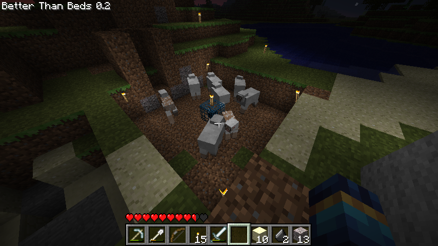

# lucoacraft

A Doom clone written in C focused on level-clearing and light fantasy.

A sector is just a **2D poly** with a **floor** and **ceiling** height. Collision is just 1) check if you're inside the sector (2D comparison) and 2) check if you're below the ceiling and above the floor (1D comparison).

These screenshots aren't mine I stole them from the Modification Station Discord server.

